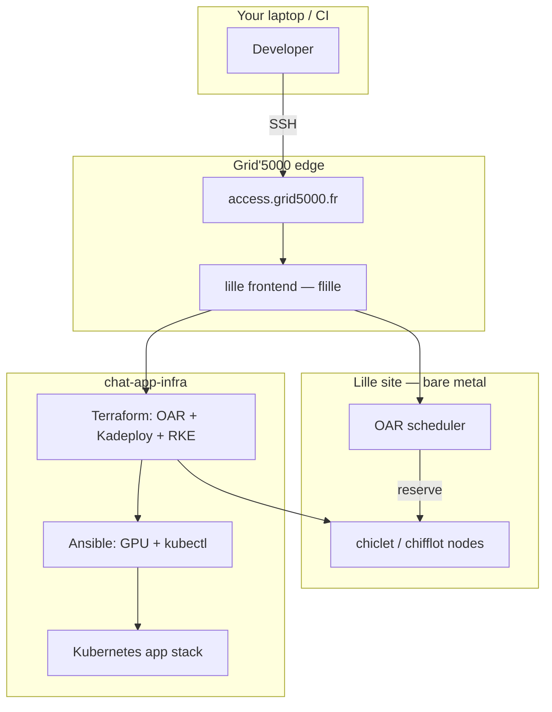
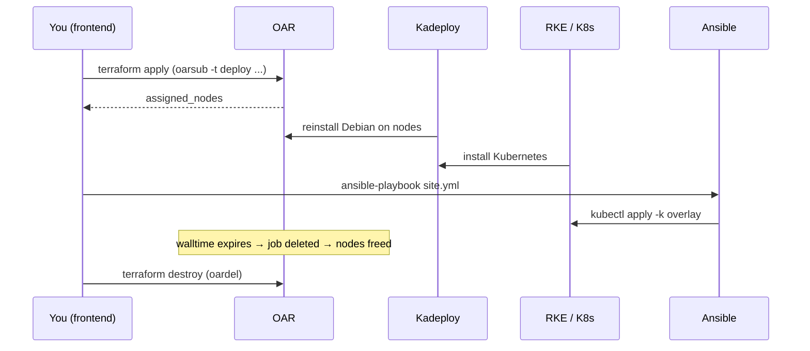

# How Grid'5000 Works

> Companion guide to the [main README](./README.md) and [How_The_App_Infra_Works.md](./How_The_App_Infra_Works.md).  
> This document explains **Grid'5000 itself** — what it is, how to connect, how reservations work, and how the **Lille clusters** map to this project.

## Related repositories

| Repository | Role | Link |
|------------|------|------|
| **chat-app-frontend** | React chat UI | [github.com/soufian-elouazzani/chat-app-frontend](https://github.com/soufian-elouazzani/chat-app-frontend) |
| **chat-app-gateway** | FastAPI API gateway | [github.com/soufian-elouazzani/chat-app-gateway](https://github.com/soufian-elouazzani/chat-app-gateway) |
| **chat-app-worker** | Async worker + Ollama client | [github.com/soufian-elouazzani/chat-app-worker](https://github.com/soufian-elouazzani/chat-app-worker) |
| **chat-app-infra** | Terraform / Ansible / Kubernetes (this repo) | [github.com/soufian-elouazzani/chat-app-infra](https://github.com/soufian-elouazzani/chat-app-infra) |

---

## What is Grid'5000?

[Grid'5000](https://www.grid5000.fr/) is a **French research testbed**: a distributed collection of bare-metal machines reserved by universities and labs for experiments in distributed systems, HPC, cloud, networking, and reproducible research.

It is **not** a commercial cloud (no AWS-style “always-on VM with a credit card”). You:

1. Get an account (research / academic context).
2. SSH into a **site frontend**.
3. **Reserve** physical nodes for a **limited time** using **OAR**.
4. Optionally **reinstall** those nodes with **Kadeploy** (e.g. fresh Debian).
5. Run your experiment (Kubernetes, benchmarks, etc.).
6. Release the reservation when done (or when **walltime** expires).

This chat-app project uses Grid'5000 as the **bare-metal layer** under Terraform → Ansible → Kubernetes.



---

## Core concepts

| Concept | Meaning |
|---------|---------|
| **Site** | A Grid'5000 location (e.g. Lille, Grenoble, Nancy). Each site has its own frontend and home directory. |
| **Cluster** | A homogeneous group of nodes at one site (e.g. `chiclet`, `chifflot`). Same hardware generation. |
| **Node** | One physical server (e.g. `chifflot-3.lille.grid5000.fr`). |
| **Frontend** | Login machine where you run `oarsub`, `terraform`, clone repos. Not part of your reservation. |
| **OAR** | Resource manager: submit jobs, reserve nodes, enforce walltime. |
| **Walltime** | Maximum job duration (hours). Job is killed when walltime ends. |
| **Kadeploy** | Reinstall OS on reserved nodes (`deploy` job type). |
| **Access machine** | SSH gateway from the internet: `access.grid5000.fr`. |

Official references:

- [Getting Started](https://www.grid5000.fr/w/Getting_Started)
- [FAQ / common commands](https://www.grid5000.fr/w/FAQ)
- [SSH tips](https://www.grid5000.fr/w/SSH)
- [Lille hardware](https://www.grid5000.fr/w/Lille:Hardware)

---

## Getting an account and connecting

### 1. Account

Create a Grid'5000 account via the official procedure (linked from [Getting Started](https://www.grid5000.fr/w/Getting_Started)). You must register an **SSH public key** — password login is disabled.

Manage keys and quotas in the [account management interface](https://www.grid5000.fr/w/Grid5000:Account_management).

### 2. First connection (two hops)

From your machine:

```bash
# Step 1 — access gateway
ssh <your-login>@access.grid5000.fr

# Step 2 — Lille site frontend (shell prompt often shows "flille")
ssh lille
# or: ssh lille.frontend.grid5000.fr
```

You work on the **frontend** for reservations and for running `terraform` / `ansible` in this project.

### 3. Recommended SSH config (direct `.g5k` hosts)

On your **local** machine, add to `~/.ssh/config` (replace `login` with your Grid'5000 username):

```sshconfig
Host g5k
  User login
  Hostname access.grid5000.fr
  ForwardAgent no

Host *.g5k
  User login
  ProxyCommand ssh g5k -W "$(basename %h .g5k):%p"
  ForwardAgent no
```

Then connect in one command:

```bash
ssh lille.g5k
scp -r ./chat-app-infra lille.g5k:
```

### 4. Clone this project on the frontend

All deploy commands in this repo are intended to run **on the Lille frontend**, not on your laptop:

```bash
ssh lille.g5k
git clone https://github.com/soufian-elouazzani/chat-app-infra.git
cd chat-app-infra
```

### 5. Tools to install on the frontend

| Tool | Used for |
|------|----------|
| `terraform` | OAR reservation + Kadeploy + RKE cluster |
| `kubectl` | Kubernetes after cluster is up |
| `ansible` / `ansible-playbook` | GPU setup + manifest apply |
| `python3` + PyYAML | `deploy.sh inventory` generation |

---

## Lille site — clusters overview

This project defaults to **`site = "lille"`** in `terraform/terraform.tfvars`.

Lille currently has **5 clusters** (see [Lille:Hardware](https://www.grid5000.fr/w/Lille:Hardware)):

| Cluster | Nodes | CPU | RAM / node | GPU | Access | Typical use in this project |
|---------|-------|-----|------------|-----|--------|----------------------------|
| **chiclet** | 8 | 2× AMD EPYC 7301 (32 cores) | 128 GiB | — | Default queue | **CPU-only K8s** — integration tests, demos without GPU |
| **chifflot** | 8 | 2× Intel Xeon Gold 6126 (24 cores) | 192 GiB | 2× P100 (most nodes) or 2× V100 (nodes 7–8) | Default queue | **GPU K8s** — Ollama with `nvidia.com/gpu` |
| **chuc** | 8 | 1× AMD EPYC 7513 (32 cores) | 512 GiB | 4× NVIDIA A100 40GB | Default queue | High-end GPU (needs account access); detected as `gpu_workers` by `deploy.sh` |
| **chirop** | 5 | 2× Xeon Platinum 8358 (64 cores) | 512 GiB | — | Default queue | Large CPU nodes |
| **chicoree** | 1 | 2× Xeon 6530P (64 cores) | 1 TiB | 4× NVIDIA H200 | **Exotic** job type | Cutting-edge GPU; special reservation rules |

Hostname pattern on Lille:

```text
<cluster>-<number>.lille.grid5000.fr
```

Examples: `chiclet-1.lille.grid5000.fr`, `chifflot-3.lille.grid5000.fr`.

### Which cluster for this chat app?

| Goal | `nodes_selector` in `terraform.tfvars` | K8s overlay |
|------|----------------------------------------|-------------|
| CPU demo / CI-style test | `{cluster = 'chiclet'}` | `grid5000-cpu` |
| Ollama on P100/V100 | `{cluster = 'chifflot'}` | `grid5000` |
| Mixed (advanced) | `{cluster IN ('chiclet', 'chifflot')}` | `grid5000` + manual GPU inventory |

**chifflot** GPU details (useful for Ollama sizing):

- Nodes **1–6**: 2× NVIDIA Tesla **P100** (16 GiB each)
- Nodes **7–8**: 2× NVIDIA Tesla **V100** (32 GiB each)

Our Kubernetes overlay requests **1 GPU** for the Ollama pod and schedules on nodes labeled `accelerator=nvidia-gpu`.

---

## OAR — how reservations work

OAR is the **scheduler**. You ask for resources; OAR assigns nodes when available and stops your job at **walltime**.

### Job types used by this project

| Type | Meaning |
|------|---------|
| `default` | Interactive or batch job on existing OS |
| **`deploy`** | Allows **Kadeploy** to reinstall the node (required for Terraform module) |

This repo’s Terraform module sets `oar_extra_types = ["deploy"]`.

### Manual equivalent of our Terraform reservation

From the Lille frontend (`flille`):

```bash
oarsub -t deploy -l walltime=4 -p "{cluster = 'chiclet'}" -r /nodes=4 \
  -n chat-app-k8s "sleep 4h"
```

| Flag | Meaning |
|------|---------|
| `-t deploy` | Deploy-type job (Kadeploy allowed) |
| `-l walltime=4` | Job lasts at most 4 hours |
| `-p "{cluster = 'chiclet'}"` | OAR SQL property filter — only chiclet nodes |
| `-r /nodes=4` | Request 4 whole nodes |
| `-n chat-app-k8s` | Job name (matches default `oar_job_name`) |
| `"sleep 4h"` | Command run on allocated nodes (keeps job alive) |

GPU example:

```bash
oarsub -t deploy -l walltime=4 -p "{cluster = 'chifflot'}" -r /nodes=4 \
  -n chat-app-k8s "sleep 4h"
```

Interactive session on one chiclet node (exploration, no deploy):

```bash
oarsub -q default -p chiclet -I
```

### Useful OAR commands (on the frontend)

```bash
# Your jobs
oarstat
oarstat -u $USER

# Cancel a job
oardel <job_id>

# List free resources (site-specific tools may vary)
oarnodes -s "cluster = 'chiclet'" -s "state = 'free'"
```

Check current availability on the [Lille resources explorer](https://public-api.grid5000.fr/explorer/drawgantt.html?site=lille) (Drawgantt / Monika).

### Walltime and quotas

- Default in this repo: **`walltime = "4"`** (4 hours) in `terraform.tfvars`.
- When walltime expires, OAR **terminates the job** and nodes return to the pool.
- Plan enough time for: Terraform apply (~15–30 min) + Ansible + Ollama model pull.
- Extend walltime only if your account quota allows it (see account management).

---

## Kadeploy — reinstalling nodes

After OAR assigns nodes, **Kadeploy** can **wipe and reinstall** Debian on them. That gives a clean, reproducible OS for Kubernetes.

Flow in this project:

```text
OAR assigns nodes  →  Kadeploy installs Debian  →  RKE installs Kubernetes
```

You do **not** run Kadeploy manually when using the Terraform module — the [pmorillon/k8s-cluster/grid5000](https://registry.terraform.io/modules/pmorillon/k8s-cluster/grid5000) module orchestrates it.

Requirements:

- Job type must include **`deploy`**
- Your SSH public key (`ssh_key_path` in Terraform) must be installed on deployed nodes as **root**

---

## RKE — Kubernetes on reserved nodes

The Terraform module uses **RKE** (Rancher Kubernetes Engine) to install:

- 1 **control plane** (+ etcd) on the first assigned node
- **Workers** on the remaining nodes

Outputs written under `terraform/`:

| Output | File / value | Purpose |
|--------|--------------|---------|
| `kubeconfig_path` | `terraform/kube_config_cluster.yml` | `kubectl`, Ansible |
| `assigned_nodes` | List of FQDNs | Ansible inventory |

```bash
export KUBECONFIG=$PWD/terraform/kube_config_cluster.yml
kubectl get nodes -o wide
```

Node **external IPs** from `kubectl get nodes -o wide` are how you reach Ingress / NodePort from outside the cluster (browser on your laptop, if routing/firewall allows).

---

## How this repository uses Grid'5000

### Terraform module

```hcl
module "k8s_cluster" {
  source  = "pmorillon/k8s-cluster/grid5000"
  version = "~> 0.0.1"

  site               = var.site          # "lille"
  nodes_count        = var.nodes_count  # e.g. 4
  walltime           = var.walltime     # e.g. "4"
  nodes_selector     = var.nodes_selector
  kubernetes_version = var.kubernetes_version
  oar_job_name       = var.oar_job_name
  ssh_key_path       = var.ssh_key_path
  oar_extra_types    = ["deploy"]
}
```

Configure via `terraform/terraform.tfvars` (copy from `terraform.tfvars.example`).

### End-to-end deploy script

`scripts/deploy.sh` runs on the **Lille frontend**:

```bash
./scripts/deploy.sh all
# terraform apply → inventory → ansible-playbook site.yml
```

### Inventory bridge (Terraform → Ansible)

After `terraform apply`, `deploy.sh inventory` reads `assigned_nodes` and writes `ansible/inventory/hosts.yml`:

| Assigned node | Ansible group |
|---------------|---------------|
| First node | `k8s_controlplane` |
| Remaining nodes | `k8s_workers` |
| Hostname contains `chifflot`, `chuc`, or `chicoree` | `gpu_workers` |

Example inventory (from `ansible/inventory/hosts.yml.example`):

```yaml
all:
  children:
    k8s_controlplane:
      hosts:
        chiclet-1.lille.grid5000.fr:
    k8s_workers:
      hosts:
        chiclet-2.lille.grid5000.fr:
        chifflot-3.lille.grid5000.fr:
    gpu_workers:
      hosts:
        chifflot-3.lille.grid5000.fr:
```

Ansible connects as **root** over SSH to prepare GPU nodes and run `kubectl` from the control plane host.

---

## Connecting to your reserved nodes

Once OAR has assigned nodes and the job is running:

### Full node reservation (this project)

With `-r /nodes=N`, you typically own the whole machine. Connect with:

```bash
ssh root@chiclet-2.lille.grid5000.fr
```

Use the same SSH key as in `terraform.tfvars` → `ssh_key_path`.

### Partial / shared reservations

For fractional jobs, Grid'5000 uses **`oarsh`** instead of direct `ssh`. This project reserves **whole nodes**, so **`ssh root@<node>`** is the normal path after Kadeploy.

### From your laptop to a node (with `.g5k` config)

```bash
ssh chiclet-2.lille.g5k
```

---

## GPU nodes on Grid'5000 (Lille)

Grid'5000 GPU nodes do **not** ship with the NVIDIA Container Toolkit preconfigured for Kubernetes. This repo’s Ansible playbooks:

1. Install `nvidia-container-toolkit` on `gpu_workers`
2. Configure containerd + restart
3. Label node: `accelerator=nvidia-gpu`
4. Install [NVIDIA device plugin](https://github.com/NVIDIA/k8s-device-plugin) in the cluster

Only then can the Ollama deployment request `nvidia.com/gpu: "1"`.

If Ollama stays **Pending**, check:

```bash
kubectl describe pod -n chat-app -l app=ollama
kubectl get nodes --show-labels | grep accelerator
```

Re-run GPU setup:

```bash
cd ansible && ansible-playbook playbooks/gpu-setup.yml
```

---

## Storage and data on Grid'5000

| Storage | Notes |
|---------|-------|
| **Home directory** | Per-site, ~25 GB default quota on frontends. Not backed up — copy important data out. |
| **Node disks** | Lost when reservation ends or Kadeploy reinstalls. |
| **Kubernetes PVCs** | RKE often uses `local-path` — data lives on the node’s disk; **not durable** across redeploys. |

For this app, PostgreSQL and Ollama PVCs are fine for **experiments**, not long-term production.

---

## Accessing the chat app after deploy

From the Lille frontend (or any machine that can reach node IPs):

```bash
export KUBECONFIG=$PWD/terraform/kube_config_cluster.yml
kubectl get nodes -o wide
kubectl -n chat-app get ingress,svc
```

| Method | URL |
|--------|-----|
| Ingress | `http://<node-external-ip>/` — API at `/api/...` |
| NodePort | Frontend `:30080`, gateway `:30800` |

Grid'5000 nodes may not be reachable from the public internet depending on site firewall rules — often you test from the frontend or university network. For a **public demo**, use a separate always-on host (see discussion in project README / Option A: Vercel + Render).

---

## Lifecycle cheat sheet



| Action | Command |
|--------|---------|
| Full deploy | `./scripts/deploy.sh all` |
| Cluster only | `make tf-apply` |
| App only (cluster exists) | `./scripts/deploy.sh k8s` or `make k8s` |
| Release resources | `make destroy` / `terraform destroy` |

Always **`terraform destroy`** when finished so nodes return to the pool for other researchers.

---

## Troubleshooting on Grid'5000

| Problem | What to check |
|---------|----------------|
| `oarsub` queues forever | Cluster fully booked — try another walltime, fewer nodes, or Drawgantt |
| `chifflot` access denied | GPU cluster may require specific account group — check [Lille:Hardware](https://www.grid5000.fr/w/Lille:Hardware) access column |
| `chicoree` fails | Needs **exotic** job type: `-t exotic` — read [Exotic jobs](https://www.grid5000.fr/w/Exotic) |
| Terraform SSH fails | Wrong `ssh_key_path`; key not in Grid'5000 account |
| `kubectl` cannot connect | `export KUBECONFIG=$PWD/terraform/kube_config_cluster.yml` |
| Job killed mid-deploy | Increase `walltime` in `terraform.tfvars` |
| No route to node IP from laptop | Normal on some sites — use frontend or SSH tunnel |
| Home quota full | `quota -s` on frontend; clean or request extension |

Support: [Grid'5000 Support](https://www.grid5000.fr/w/Support).

---

## Mapping Grid'5000 → this project (summary)

```text
Grid'5000 (Lille)
  chiclet / chifflot nodes
       │
       ▼
  Terraform (OAR + Kadeploy + RKE)
       │  kube_config_cluster.yml
       │  assigned_nodes
       ▼
  Ansible (NVIDIA + kubectl apply -k)
       │
       ▼
  Kubernetes namespace chat-app
       frontend, gateway, worker, postgres, redis, rabbitmq, ollama
```

For layer-by-layer details of Terraform, Ansible, and Kubernetes manifests, see **[How_The_App_Infra_Works.md](./How_The_App_Infra_Works.md)**.

---

## Official links

| Resource | URL |
|----------|-----|
| Grid'5000 home | https://www.grid5000.fr/ |
| Getting Started | https://www.grid5000.fr/w/Getting_Started |
| Lille hardware | https://www.grid5000.fr/w/Lille:Hardware |
| Lille inventory API | https://public-api.grid5000.fr/explorer/inventory/lille/ |
| Drawgantt (Lille) | https://public-api.grid5000.fr/explorer/drawgantt.html?site=lille |
| Terraform grid5000 provider | https://registry.terraform.io/providers/pmorillon/grid5000 |
| k8s-cluster module | https://registry.terraform.io/modules/pmorillon/k8s-cluster/grid5000 |

---

*Last updated: August 2026 — cluster specs sourced from [Lille:Hardware](https://www.grid5000.fr/w/Lille:Hardware).*
