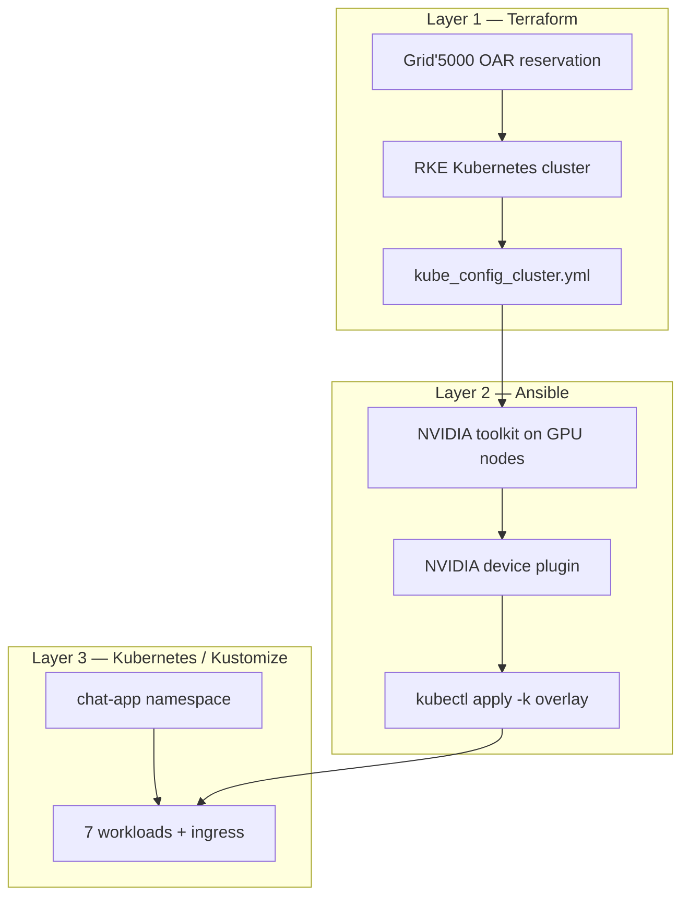
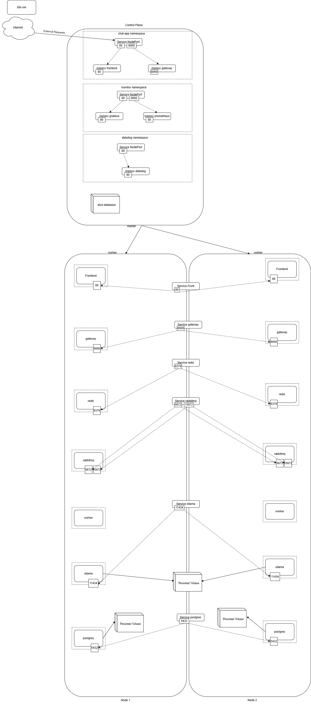
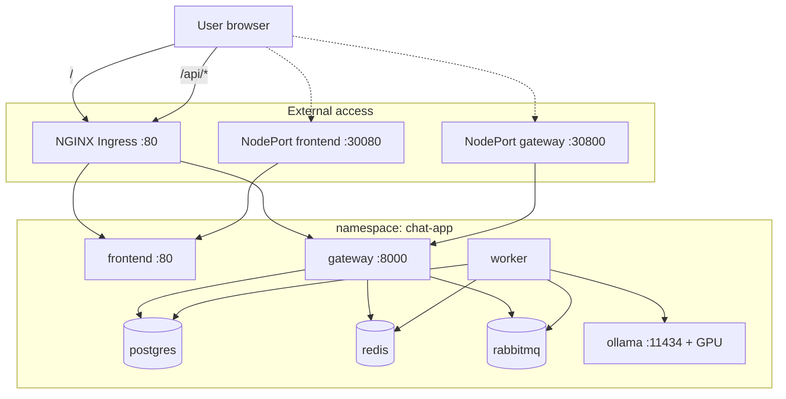

The big picture of the application:
to set up the deployement of an applciation on the cloud we should manly handle three major layers: 

Layer 1- the operating system provisioning (in our case we gonna reserve Nodes on Grid'5000) , and setting up a kubernetes cluster with the master the wokrkers ready to accept our application configuration.

Layer 2- we need to install what we need on those provisioned machiens in orther for our application to work in our case we need Nvidia toolkit, Nvidia device plugin, lunch the command Kubectl apply -k overlay

Layer 3- the third abstraction layer is to apply the kubenetes manifest for the app to be operational

additionaly to these layers we should add the monitoring in our case promethous/grafana which give us insights on our app the the runtime


we have a script deploy.sh that runs all these steps.

after the setup from Terraform and Ansible the most important step is the Manifest of the kubernetes. so that what we gonna be focusing on in this layer more.

here is the layout of the repo in kubernetes:
```text
kubernetes/
├── base/                    # Full app stack (environment-agnostic)
│   ├── kustomization.yaml   # Lists every resource + common labels
│   ├── namespace.yaml
│   ├── configmap.yaml       # Non-secret config
│   ├── secrets.yaml         # DB URLs, API keys, connection strings
│   ├── postgres/            # StatefulSet + headless Service + init SQL
│   ├── redis/
│   ├── rabbitmq/
│   ├── ollama/              # Deployment + PVC + Service
│   ├── gateway/
│   ├── worker/
│   ├── frontend/
│   └── ingress/             # NGINX Ingress + NodePort fallbacks
└── overlays/
    ├── grid5000/            # GPU overlay (Ollama gets GPU + nodeSelector)
    └── grid5000-cpu/        # Same stack, no GPU patch
```

after the creation of the cluster we gonna something like this :



Workloads: each service and its role

1. PostgreSQL (StatefulSet)
Why StatefulSet? Stable identity + persistent disk via volumeClaimTemplates (10 Gi).
Service: headless (clusterIP: None) — standard pattern for StatefulSets.
Init: postgres-init ConfigMap mounts SQL that creates users, chat_sessions, messages, model_configs.
Consumers: gateway and worker via DATABASE_URL.

2. Redis (Deployment)
In-memory cache / pub-sub.
Consumers: gateway and worker via REDIS_URL.

3. RabbitMQ (Deployment)
Message queue between gateway and worker.
Ports: 5672 (AMQP), 15672 (management UI, internal only).
Consumers: gateway publishes jobs; worker consumes them.

4. Ollama (Deployment + PVC)
LLM inference server (ollama/ollama:latest).
PVC ollama-data: 50 Gi for downloaded models.
Strategy Recreate: only one pod at a time (GPU + single PVC).
Consumer: worker calls OLLAMA_URL

5. Gateway (Deployment)
FastAPI API (soufian1/chat-app-gateway:latest), port 8000.
Talks to: postgres, redis, rabbitmq.
Health checks hit /docs.
Publishes async work to RabbitMQ for the worker.

6. Worker (Deployment)
Background consumer (soufian1/chat-app-worker:latest).
Talks to: postgres, redis, rabbitmq, ollama.
No exposed port — it only pulls from the queue.

7. Frontend (Deployment)
React UI (soufian1/chat-app-frontend:latest), port 80.
VITE_API_URL=/api so the browser calls the ingress API path, not the gateway directly.


Layer 1 terraform descreption:

the terraform concept allows you to provision ressources just by writing code in a term called Infrastrectur as code, this mecanisme helps you to provision ressources very quicly and effectivly in a reproducible way, and the in a controlled and collaborative maner when integrating with Git.
that said in this implementation we use Grid'5000 as our provider which is a french distrebuted system cluster for universety reaserchers  that let you provision ressources with a system called OAR that reserve nodes based on availability of those ressources.

the module k8s_cluster allows you to reserve X nodes (nodes_count) one a  site for a duration called walltime, and each site has many clusters some of them they have GPUs some of them not, so we specify the name of the cluster here, after we have the kubernetes version that we need to install in our new kubernetes cluster, and the ssh key to connect to the reserved nodes.
```
module "k8s_cluster" {
  source  = "pmorillon/k8s-cluster/grid5000"
  version = "~> 0.0.1"

  site               = var.site
  nodes_count        = var.nodes_count
  walltime           = var.walltime
  nodes_selector     = var.nodes_selector
  kubernetes_version = var.kubernetes_version
  oar_job_name       = var.oar_job_name
  ssh_key_path       = var.ssh_key_path
  deb_extra_pkgs     = var.deb_extra_pkgs
  oar_extra_types    = ["deploy"]
}
```

if we logicly seperate those concepts we have three steps in terraform:
step 1: using OAR technology to reserve nodes the equivement of the command :
```
oarsub -t deploy -l walltime=4 -p "{cluster = 'chiclet'}" -r /nodes=4 \
  -n chat-app-k8s "sleep 4h"
```
step 2: using Kadeploy technology to reinstall debian using the deploy type

step 3: using RKE technology to install the kubernetes conrol plane + workers 

Terraform output after the execution to let Ansible continue:
terraform/kube_config_cluster.yml for the kubectl commands 
assigned_nodes that contains List of hostnames that Ansible will need in the inventory to connect to the machines 


the bridge deploy.sh between the results of the terraform and the start of the ansible execution
after the terraform apply the script reads assigned_nodes and inject that in the hosts.yml for ansible , Node 0 for the k8s controleplane 
and the other nodes are for the workers k8s_workers 
and if Hostnames containing chifflot/chuc/chicoree → gpu_workers 

Layer 2:
Ansible execution, so fill the gap between the hosts are up and we have thier adresses and the kubernetes is already there installed and to apply our application that already configured to be running in a kubernetes cluster we should Ansible is the best fit for this since we gonna use just the IP adresses to connect to the nodes and install what we want.

first we should install nvidia_toolkit that has the requirement to use the GPU in all the GPU nodes, and then we gonna install the nvidia_device_plugin, in the control node so that the control node can use it, and then we gonna apply the k8s_app as a kubectl command to populate our empty cluster

Play 1 — nvidia_toolkit role (on all hosts, GPU nodes only)
Runs on every node but skips nodes without an NVIDIA GPU (lspci check).

On GPU nodes it:

Installs nvidia-container-toolkit
Configures containerd for the NVIDIA runtime
Restarts containerd
Labels the node: accelerator=nvidia-gpu (required for Ollama scheduling)
Play 2 — nvidia_device_plugin role (control plane)
Applies the official NVIDIA device plugin manifest into kube-system
Waits for the DaemonSet to be ready
This exposes nvidia.com/gpu as a schedulable resource inside Kubernetes.

Play 3 — k8s_app role (control plane)
Runs kubectl apply -k kubernetes/overlays/{{ k8s_overlay }} (default: grid5000)
Waits for rollouts: redis, rabbitmq, gateway, worker, frontend, postgres, ollama
Optionally pulls an Ollama model (llama3.2:3b by default)
Prints ingress/service info for access
Ansible variables (ansible/group_vars/all.yml)




Repository map (everything with it roles)
```text
chat-app-infra/
├── terraform/              Layer 1 — OAR + Kadeploy + RKE cluster
│   ├── main.tf             Grid'5000 k8s-cluster module
│   ├── variables.tf        Site, nodes, walltime, selector
│   ├── outputs.tf          kubeconfig path + node list
│   └── terraform.tfvars    Your reservation settings (not committed)
│
├── ansible/                Layer 2 — node prep + kubectl apply
│   ├── playbooks/
│   │   ├── site.yml        Full pipeline
│   │   ├── gpu-setup.yml   GPU only
│   │   └── deploy-app.yml  K8s manifests only
│   ├── roles/
│   │   ├── nvidia_toolkit/     Drivers + containerd + node label
│   │   ├── nvidia_device_plugin/  GPU scheduling in K8s
│   │   └── k8s_app/            apply -k, wait, ollama pull
│   ├── group_vars/all.yml  kubeconfig, overlay, images, ollama model
│   └── inventory/hosts.yml Generated from terraform (or manual)
│
├── kubernetes/             Layer 3 — application manifests
│   ├── base/               Full app stack
│   └── overlays/           grid5000 (GPU) / grid5000-cpu
│
├── scripts/deploy.sh       Orchestrates all phases
├── Makefile                Shortcuts (tf-apply, ansible, k8s, destroy)
└── README.md               Operator documentation

```