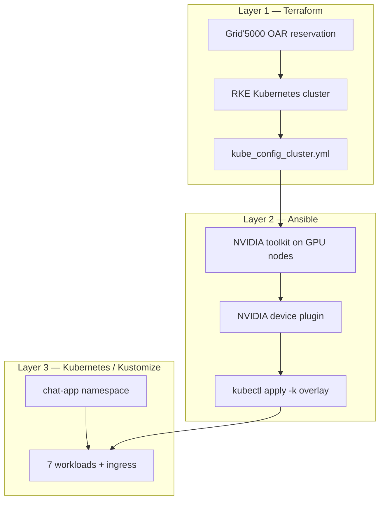

The big picture of the application:
to set up the deployement of an applciation on the cloud we should manly handle three major layers: 

Layer 1- the operating system provisioning (in our case we gonna reserve Nodes on Grid'5000) , and setting up a kubernetes cluster with the master the wokrkers ready to accept our application configuration.

Layer 2- we need to install what we need on those provisioned machiens in orther for our application to work in our case we need Nvidia toolkit, Nvidia device plugin, lunch the command Kubectl apply -k overlay

Layer 3- the third abstraction layer is to apply the kubenetes manifest for the app to be operational

additionaly to these layers we should add the monitoring in our case promethous/grafana which give us insights on our app the the runtime

we have a script deploy.sh that runs all these steps.

after the setup from Terraform and Ansible the most important step is the Manifest of the kubernetes. so that what we gonna be focusing on in this layer more.

here is the layout of the repo in kubernetes:
kubernetes/
├── base/                    # Full app stack (environment-agnostic)
│   ├── kustomization.yaml   # Lists every resource + common labels
│   ├── namespace.yaml
│   ├── configmap.yaml       # Non-secret config
│   ├── secrets.yaml         # DB URLs, API keys, connection strings
│   ├── postgres/            # StatefulSet + headless Service + init SQL
│   ├── redis/
│   ├── rabbitmq/
│   ├── ollama/              # Deployment + PVC + Service
│   ├── gateway/
│   ├── worker/
│   ├── frontend/
│   └── ingress/             # NGINX Ingress + NodePort fallbacks
└── overlays/
    ├── grid5000/            # GPU overlay (Ollama gets GPU + nodeSelector)
    └── grid5000-cpu/        # Same stack, no GPU patch

